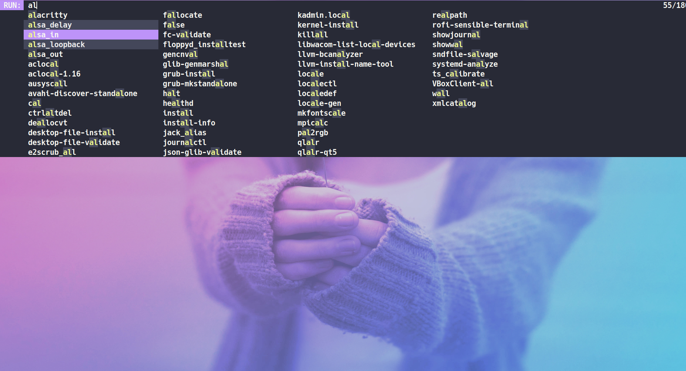

# GLR-DMENU



[dmenu](https://tools.suckless.org/dmenu/) is a dynamic menu for X, originally designed for dwm.\
It manages large numbers of user-defined menu items efficiently.

## My build

glr-dmenu is my personal build of dmenu I made to satisfy my needs. These are all the patches I've included so far:

- case insensitive - ignores capital letters
- grid - renders dmenu's entries in a grid
- highlight - highlights the individual characters of matched text for each entry
- line height - makes possible to set the height of a dmenu line
- morecolor - creates an additional color scheme, for use with the entries adjacent to the selection
- mouse support - enables basic mouse support
- numbers - adds text which displays the number of matched and total items

### Mouse support
Mouse actions supported:

- Left-mouse click:
    - On prompt and input field: clear input text and selection.
    - In horizontal and vertical mode on item: select and output item (same as pressing enter).
    - In horizontal mode on arrows: change items to show left or right.
- Ctrl-left-mouse click: multisel modifier.
- Right-mouse click: close.
- Middle-mouse click:
    - Paste current selection.
    - While holding shift: paste primary selection.
- Scroll up:
    - In horizontal mode: same as left-clicking on left arrow.
    - In vertical mode: show items above.
- Scroll down:
    - In horizontal mode: same as left-clicking on right arrow.
    - In vertical mode: show items below.

### New options

- -h height (line height)
- -g columns (number of columns)
- -s (case sensitive)

## Installing glr-dmenu on Arch Linux

glr-dmenu is available in the [AUR](https://aur.archlinux.org/packages/glr-dmenu-git/).

**OR**

You can clone this repository or simply download the `PKGBUILD` file.\
Either way, make sure you're in the same directory as the `PKGBUILD` file and run:

```bash
makepkg -cf
```

This will create a pkg.tar.zst file. Install it running this command:

```bash
sudo pacman -U name-of-package.pkg.tar.zst
```

## Installing glr-dmenu on other distributions

Clone this repository:

```bash
git clone https://gitlab.com/glr01/glr-dmenu.git
```

Then run:

```bash
cd glr-dmenu
sudo make clean install
```

---

> glr-dmenu conflicts with standard dmenu. Make sure to backup your existing dmenu as this will overwirte it.
